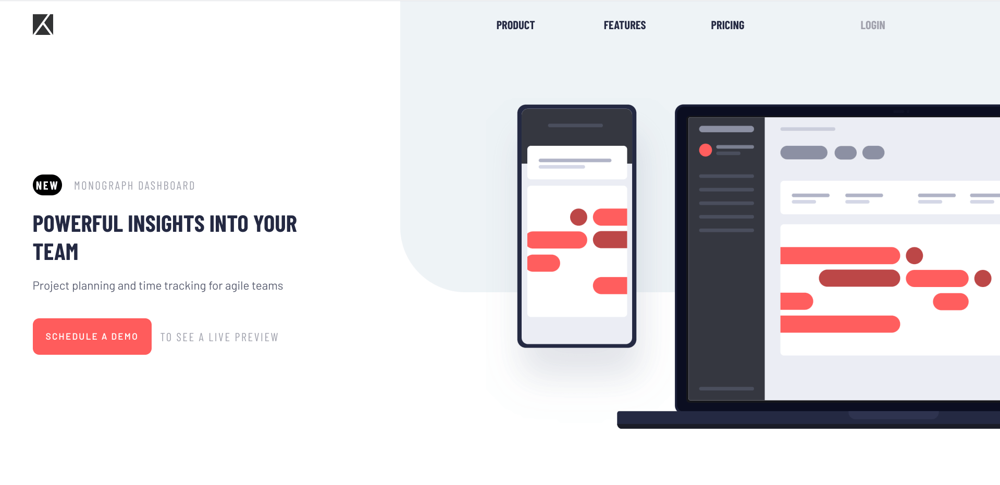
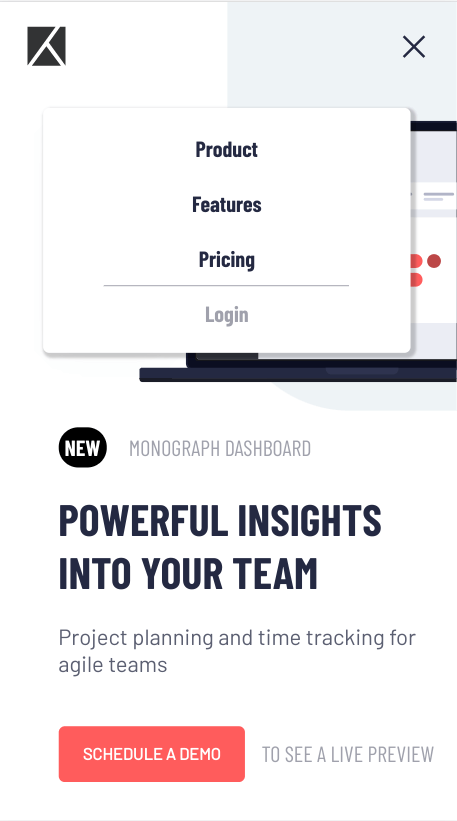

# Frontend Mentor - Project tracking intro component solution

This is a solution to the [Project tracking intro component challenge on Frontend Mentor](https://www.frontendmentor.io/challenges/project-tracking-intro-component-5d289097500fcb331a67d80e). Frontend Mentor challenges help you improve your coding skills by building realistic projects. 

## Table of contents

- [Overview](#overview)
  - [The challenge](#the-challenge)
  - [Screenshot](#screenshot)
  - [Links](#links)
- [My process](#my-process)
  - [Built with](#built-with)
  - [What I learned](#what-i-learned)
  - [Continued development](#continued-development)
  - [Useful resources](#useful-resources)

## Overview

### The challenge

Users should be able to:

- View the optimal layout for the site depending on their device's screen size
- See hover states for all interactive elements on the page
- Create the background shape using code

### Screenshot

### Links

- Live Site URL: [Github Pages](https://jdegand.github.io/project-tracking-intro-component/)

## My process

### Built with

- Semantic HTML5 markup
- CSS custom properties
- Flexbox
- CSS Grid

### What I learned

### Continued development

- Used an extra li item for spacing.
- Duplicated navs.
- Could have used sections inside of the main.

### Useful resources

- [MDN Docs](https://developer.mozilla.org/en-US/docs/Web/CSS/::after) - ::after property
- [Blog](https://bryanlrobinson.com/blog/how-to-css-after-elements-for-background-overlays/) - Background overlays
